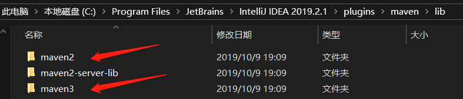
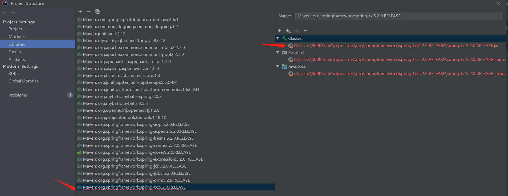
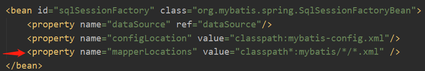
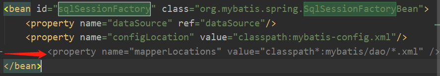
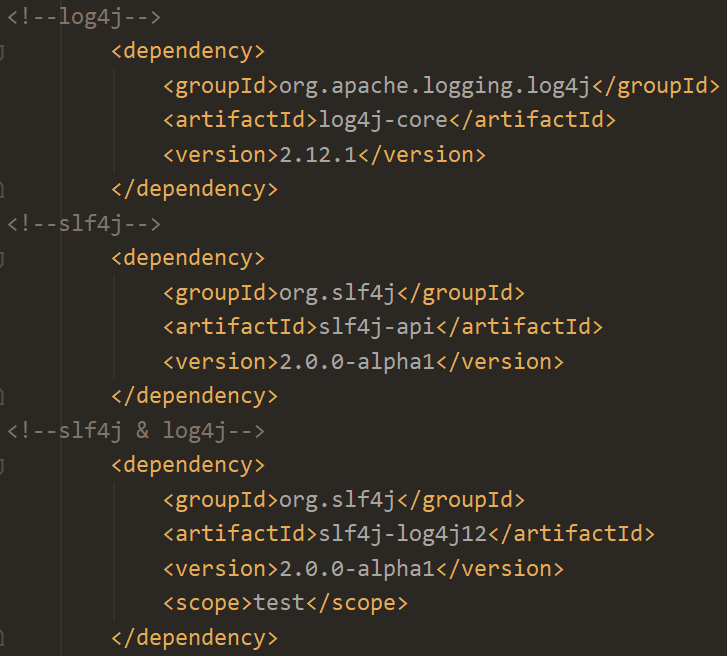
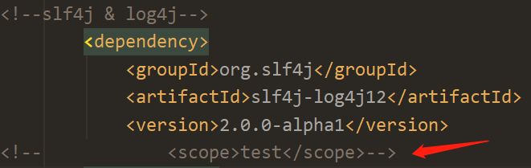

##### 1、[08001] Could not create connection to database server. Attempted reconnect 3 times. Giving up. (intellij mysql)
1)url后添加
```
?serverTimezone=UTC
```		
2)本地的mysql没有运行或创建该数据库		
3)IP地址不对		
4)3306端口被占用: https://blog.csdn.net/New_feature/article/details/83683924		
5)mysql版本问题		
6)项目的路径里包含中文字符
<hr>

##### 2、Intellij idea 报错：Error : java 不支持发行版本12
先确保java环境变量版本正确(cmd 输入 echo %JAVA_HOME%)		
1)https://blog.csdn.net/qq_22076345/article/details/82392236 (后面编译时 可能又变回去 需要重复修改)			
2)pom.xml添加 (可持续)		
```
   <build>
        <plugins>
            <plugin>
                <groupId>org.apache.maven.plugins</groupId>
                <artifactId>maven-compiler-plugin</artifactId>
                <version>2.0.2</version>
                <configuration>
                    <source>12</source>
                    <target>12</target>
                </configuration>
            </plugin>
        </plugins>
    </build>
```
3)修改里面的setting.xml文件(在 profiles 标签里添加) (可持续)

```
    <profile>       
     <id>jdk-12</id>       
     <activation>       
         <activeByDefault>true</activeByDefault>       
         <jdk>12</jdk>       
     </activation>       
     <properties>       
         <maven.compiler.source>12</maven.compiler.source>       
         <maven.compiler.target>12</maven.compiler.target>       
         <maven.compiler.compilerVersion>12</maven.compiler.compilerVersion>       
     </properties>       
    </profile>
```
<hr>

##### 3、cannot be opened because it does not exist (xml)
文件放入 resources

<hr>

##### 4、java.lang.NoClassDefFoundError
jar包的问题		
1)jar包之间有冲突		
2)maven并没有下载成功，如果reimport失败就需要手动下载jar包

<hr>

##### 5、org.apache.ibatis.binding.BindingException: Invalid bound statement (not found)
查找问题 https://my.oschina.net/MIKEWOO/blog/1785705		
或添加(但可能出现error6)

<hr>

##### 6、Error creating bean with name 'sqlSessionFactory' defined in class path resource
尝试删去

<hr>

##### 7、java.sql.SQLException: Field 'id' doesn't have a default value
在mysql数据库中，自增长id没有设为Auto Increment
<hr>

##### 8、org.apache.ibatis.binding.BindingException: Parameter 'studentId' not found. Available parameters are [arg2, arg1, arg0, param3, param1, param2]
多参数需要用 @Param("studentId")
<hr>

##### 9、SLF4J: No SLF4J providers were found.
在官网和大部分说法是缺少 中间层 slf4j-log4j12.jar (但我已经加入 所以问题不在这里)

魔法了一会 发现注解掉 
```
<scope>test</scope> 
```
后可以正常运行 (原来 test 不作用在运行时。)

scope标签:https://www.jianshu.com/p/a4fc54b5a6bf      
maven官网解释:https://howtodoinjava.com/maven/maven-dependency-scopes/
<hr>

##### ( <b> X  </b>) 10、ERROR StatusLogger No Log4j 2 configuration file found. 
https://www.cnblogs.com/Hugooscar/p/6105327.html
