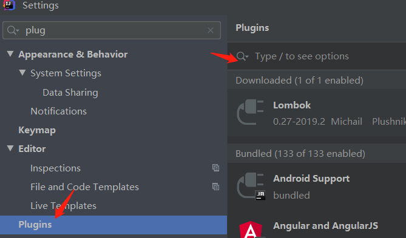

## 1、IDEA

##### 1、IDEA 内置 mysql 数据库 使用方法
https://www.twblogs.net/a/5c36cf29bd9eee35b21d4491

##### 2、IDEA中不能创建xml文件(或其他类型)
https://blog.csdn.net/nba_linshuhao/article/details/82735770

##### 3、IDEA连接mysql后不显示表
https://blog.csdn.net/u012834773/article/details/89893678

##### 4、IDEA 用了lombok依赖 不显示注解添加的方法
lombok 加依赖后 还需要在ideal中加插件

## 2、Spring

##### 1、类名 不能 和注解等重名

##### 2、bean 啥时候要实现Serializable接口
https://blog.csdn.net/hhx0626/article/details/61919232

## 3、Mybatis

##### 1、mybatis 别名(标签 / 注解)
https://blog.csdn.net/majinggogogo/article/details/71503263

##### 2、mybatis 文档
https://mybatis.org/mybatis-3/zh/index.html

##### 3、mybatis 多表查询
双向关联时，toString()方法只让某一方可以输出另一方即可，否则会导致递归调用，程序出错。			
property:类属性名  column:对应列名  ofType:泛型类   javaType:类	
 
自关联查询、多表连接查询、多表单独查询、子孙查询 			
https://www.jianshu.com/p/ae60478c3dc0 (详细清晰 层次分明)
 			
associattion(对应一个对象)、collection(多个对象)、ResultType 自动映射、ResultMap 手动映射			
https://zhuanlan.zhihu.com/p/59972837 (方便复现 但较混乱)

##### 4、mybatis 注解
https://www.jianshu.com/p/828d2bd12b2f

## 4、Other

##### 1、log4j & slf4j 使用
https://www.cnblogs.com/ywlaker/p/6124067.html 			
https://michael728.github.io/2019/08/10/java-spring-boot-log4j2/

##### 2、lombok@Data和@Builder一起用无法添加无参构造方法
https://blog.csdn.net/w605283073/article/details/89221853

##### 3、lombok 注解
https://www.jianshu.com/p/8a664c248472

