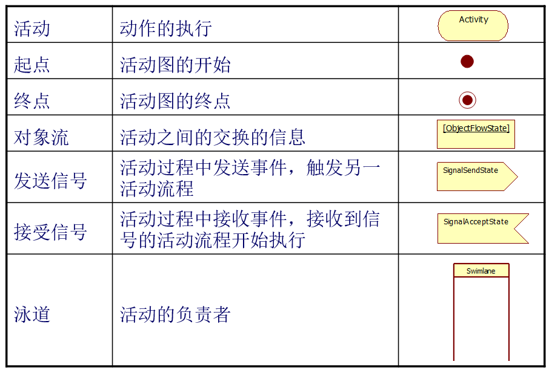
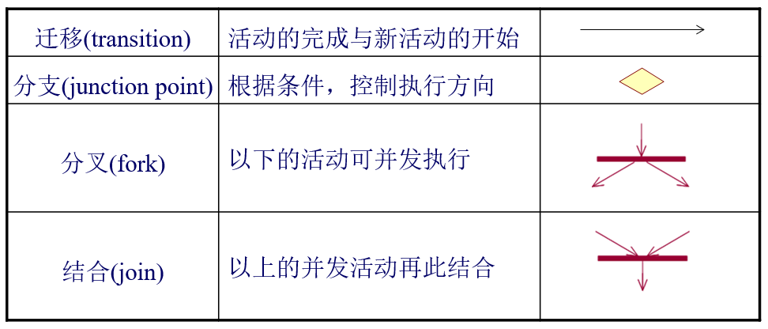
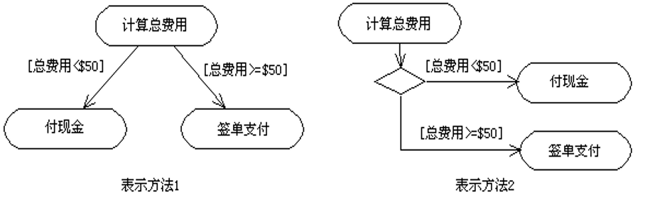
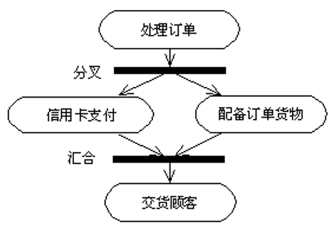
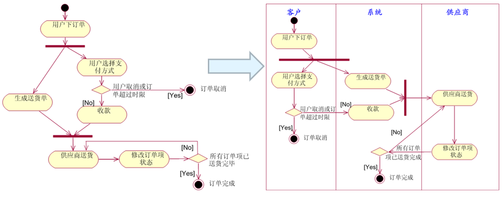
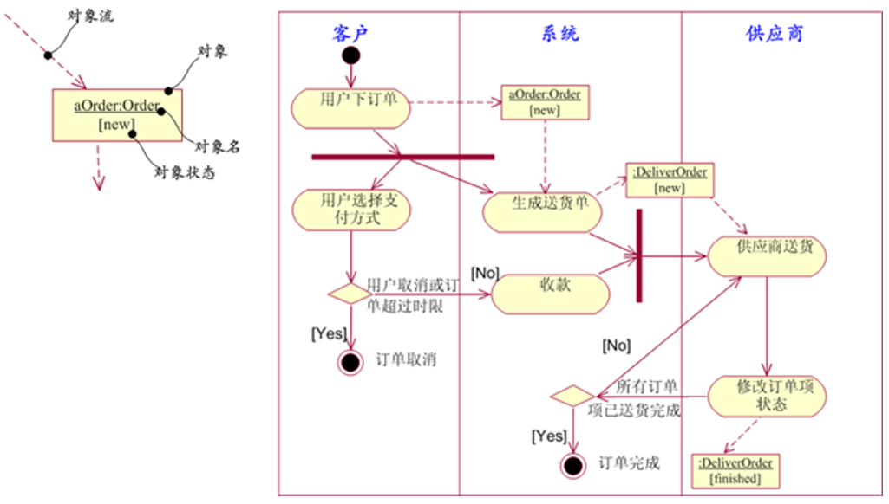

### 活动图
描述对象的一个活动到另一个活动的控制流，活动的序列，工作的流程和并发的处理行为等。一个控制流关联的两个活动**可以是一个对象**的，**也可以是多个对象**的。用**泳道**进行说明。			
<!-- 在进行用例分析时，可以用活动图来描述具体的工作流程，即业务过程描述。 -->

#### 活动图模块

#### 概念
 

##### 1、分支
对于同一个触发事件，可以根据不同的警戒条件转向不同的活动，每个可能的转移是一个分支。

##### 2、分叉、汇合
分叉表示的是一个控制流被两个或多个控制流代替，经过分叉后，这些控制流是并发进行的。			
汇合正好与分叉相反，表示两个或多个控制流被一个控制流代替。

##### 3、泳道
泳道（swimlane）是活动图中的区域划分，根据每个活动的职责对所有活动进行划分，**每个泳道代表一个责任区**。
 
泳道和类并不是一一对应的关系，泳道关心的是其所代表的**职责((，**一个泳道可能由一个类实现，也可能由多个类实现**。
 
**不带泳道**的活动图，在**需求分析**中建模，用于刻画一个用例的**用例描述**。
 
**带泳道**的活动图，在**系统分析及设计**中建模，用于刻画一个用例的用例描述中的步骤如何**落实到对象**。

##### 4、对象流
对象可以作为活动的输入或输出。例如，一个活动创建对象（作为活动的输出），或者，使用对象（作为活动的输入）。			
活动可以修改对象状态。			
活动图中画出对象流，就是强调这个对象在这个活动中的重要性。

##### 5、信号
与状态图中的“信号”概念相同。		
信号是表示两个对象之间异步通信的方式。
