#### 类的属性的语法格式

+（公有属性Public）：能够被系统中其他任何操作查看和使用			
-（私有属性Private）：仅在类内部可见，只有类内部的操作才能存取该属性			
#（受保护属性Protected）：供类中的操作存取，也可被其子类使用
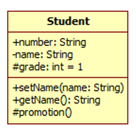

#### 类之间的关系

##### 关联关系
一个类的实例与另一个类的实例在结构上的静态联系
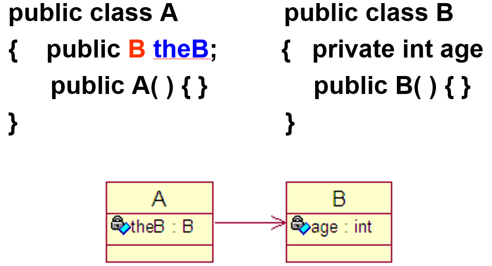

##### 依赖关系
一个类的结构上的变化会影响到另一个类（代码级）
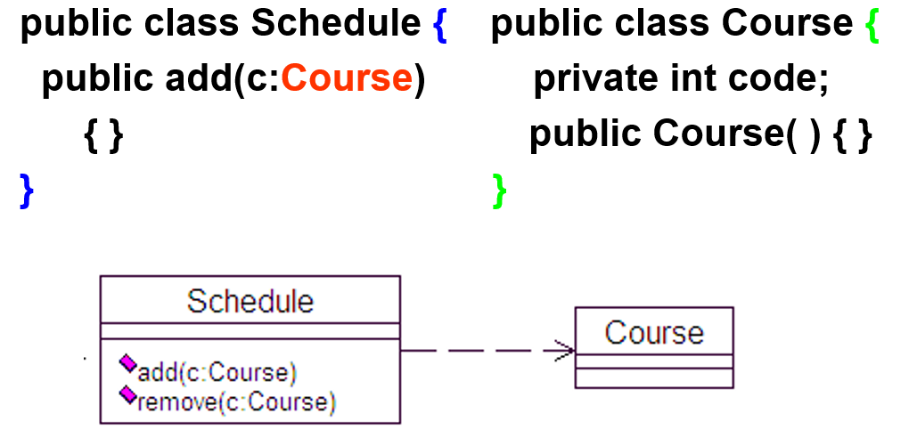

##### 泛化关系
一般类与特殊类之间的继承（代码级）
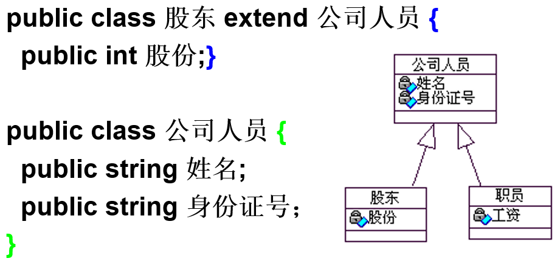

##### 关联关系的相关概念

{} *Company类和Person类之间的关联如果不使用关联名，则可以有多种解释，如Person类可以表示是公司的客户、雇员或所有者等*

 {}
{} *Company类以employer的角色、Person类以employee的角色参与关联*

 {}
 {} *公司可以雇佣多个雇员，表示为0..n；雇员只能被一家公司雇佣，表示为1。*

 {}
 {}  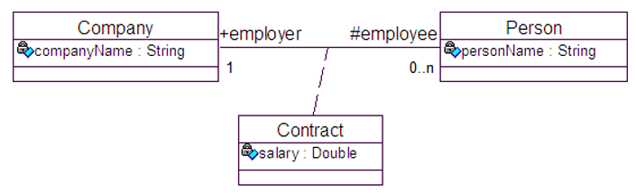
 {}
{} *Account类或者与Person类有关联，或者与Corporation类有关联，但不能同时与Person类和Corporation类都有关联*
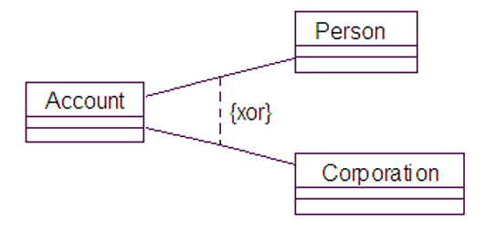
 {}
{} *一个person可以在bank中有多个account。
但给定了一个account值后，就可以对应一个person值*
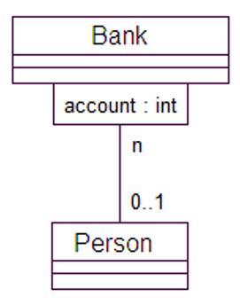
 {}
{} *“人”类的自返关联“结婚”。一个人与另一个人结婚，必然一个扮演丈夫角色，另一个扮演妻子角色。*
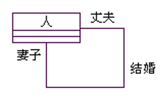
 {}
{} *一个运动员（player）在某一个年份（year）中在某一个运动队（team）中服役*
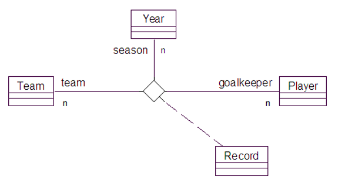
 {}
{} *舰队不存在时，船只依然存在*

 {}
{} *圆不存在时，构成圆的点也不存在了*
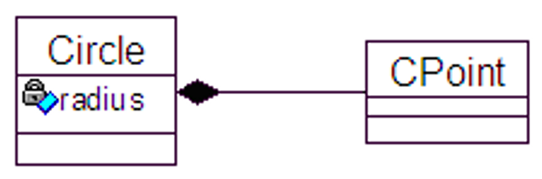
 {}

#### 接口
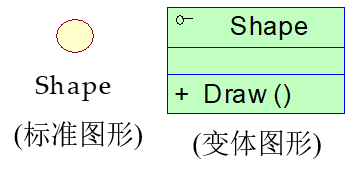

##### 实现关系
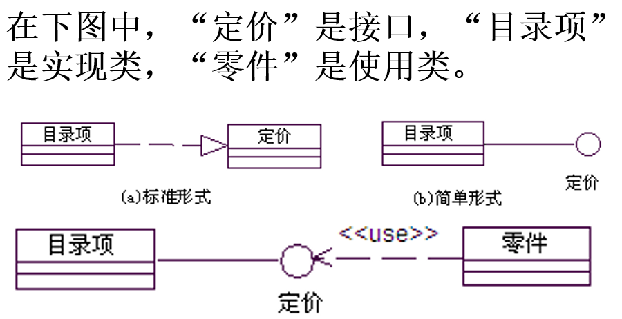
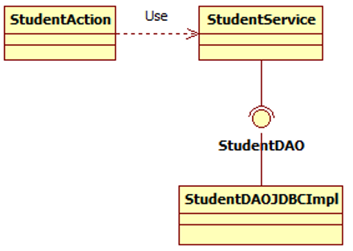

#### 类的版型
UML中有3种主要的类版型：边界类（boundary class）、控制类（control class）和实体类（entity class）

##### 实体类
用于保存需要放进持久存储体的信息。
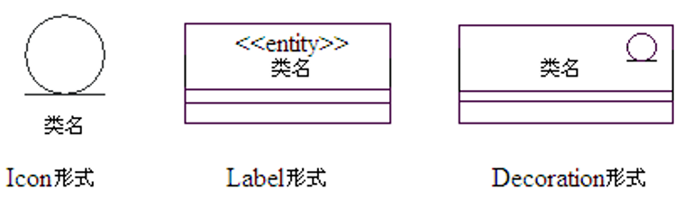

##### 控制类
是负责其他类工作的类。根据业务规则，执行相应脚本流，以委托责任的形式向其他类发出消息，由其他类来实现具体的功能。(协调边界类和实体类之间的交互)

##### 边界类
位于系统与外界的交界处，它是系统内的对象和系统外的参与者的联系媒介。外界的消息只有通过边界类的对象实例才能发送给系统。
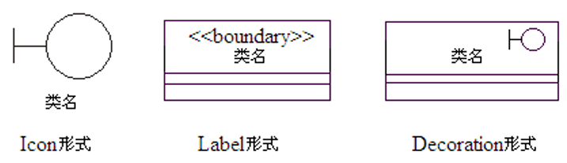

##### 边界类、控制类、实体类协作
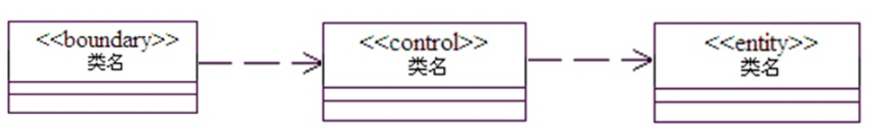

#### 对象图（object diagram）

##### 类图与对象图的对比
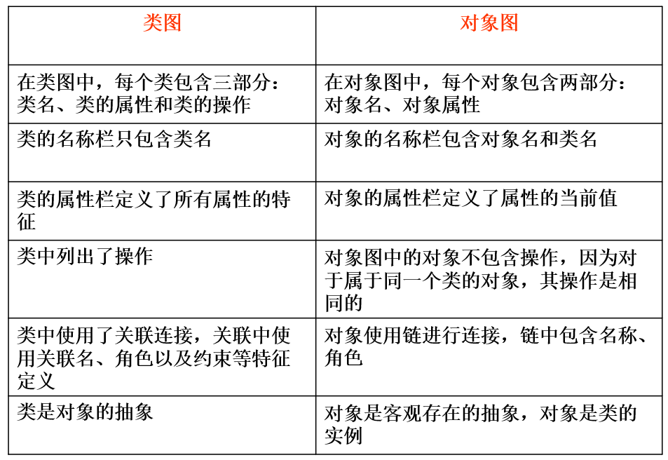
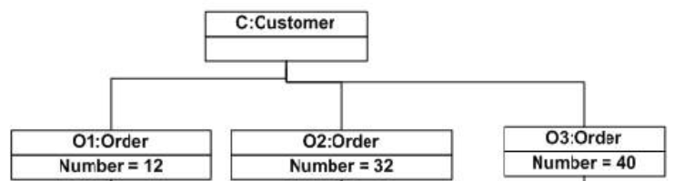
