### 顺序图

##### 概念

对象：同类图中的对象，是类的实例		 
生命线：从对象图标向下延伸的一条虚线，表示对象存在的生命期		
控制焦点（激活期）：对象执行一个动作的时间段		
消息：对象间的一次通信		
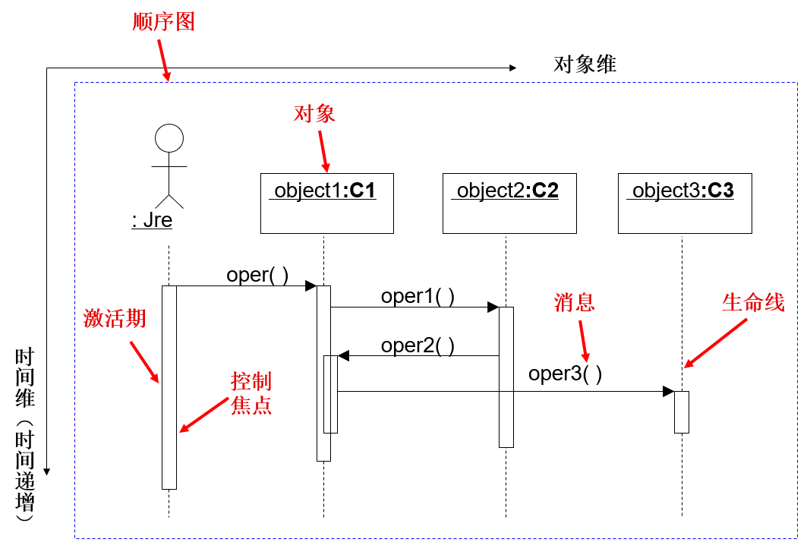

顶端的对象（ob3:C3，ob4:C4）：表明在本次交互活动的开始时刻，已经存在了
 
箭头指向的对象（ob1:C1，ob2:C2）：表明在本次交互活动的过程中创建的
 
虚线的末端标记X：表明在本次交互活动的结束时刻，顶端代表的对象会被销毁
  
虚线的末端一直延伸下去：表明在本次交互活动的结束时刻，顶端代表的对象会继续存在
 
分支：从同一点发出多条消息，并指向不同的对象(又分条件分支、并行分支)
 
从属流：从同一点发出多条消息，并指向同一个对象的不同生命线
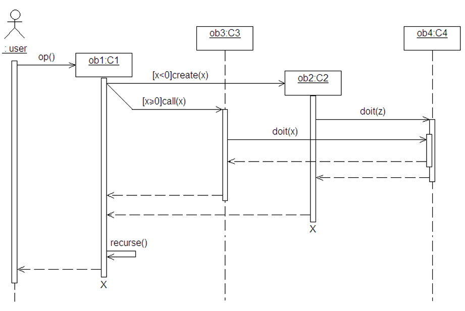

##### 消息种类
(1) 调用消息：调用（procedure call）消息的发送者把控制传递给消息的接收者，然后**停止活动**，**等待**消息接收者**放弃**或**返回控制**。调用消息可以用来表示**同步**的意义
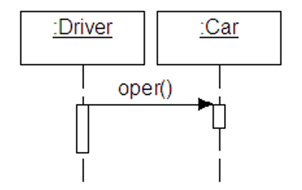
(2) 异步消息：异步（asynchronous）消息的发送者通过消息把信号传递给消息的接收者，然后**继续**自己的活动，**不等待**接收者返回消息或控制。异步消息的接收者和发送者是**并发**工作的。
 
 {} *调用消息主要用于控制流在完成之前需要中断的情况；*		
 *异步消息主要用于控制流在完成之前不需要中断的情况。*
  {} _账号和密码的对错判断完成之前，对象“:Web页面”的第一个**控制焦点**表达的活动**必须被中断**。因此，“用户验证()”消息是调用消息。_	
   	 
  _在进行分数登记的时候，同时会写入日志文件，即分数登记操作不需要中断。也就是说，对象“:分数登记”的**控制焦点**表达的活动**不会被中断**。因此，“写入日志文件()”消息是异步消息。_
 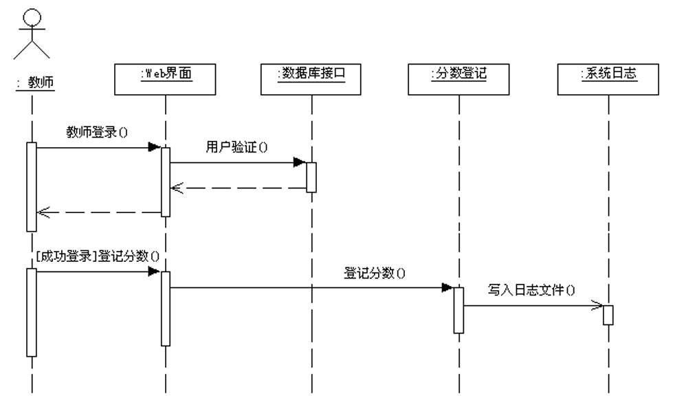
 {}
 {}

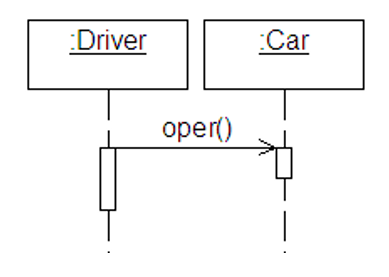
(3) 返回消息：返回（return）消息表示前面发出的消息要返回的消息值。**如果是从过程调用返回**，则返回消息是**隐含**的，可以不用画出来。**对于非过程调用，如果有返回消息**，**必须**明确表示出来。
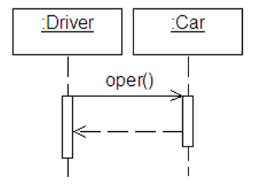
(4) 反身消息：在反身消息中，消息的发送者和接收者是**同一个对象**。
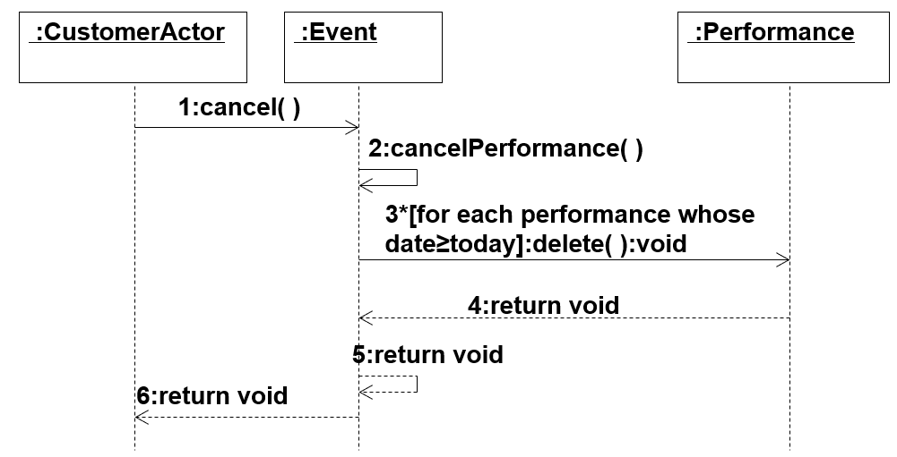
(5) 阻止消息：阻止消息是指消息发送者发出消息给接收者，如果接收者**无法立即接收**消息，则发送者**放弃**这个消息。
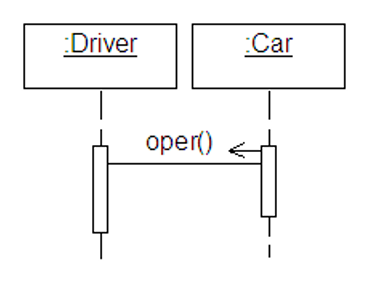
(6) 超时消息：超时消息是指消息发送者发出消息给接收者并**按指定时间等待**。如果接收者**无法在指定时间内接收**消息，则发送者**放弃**这个消息。
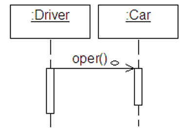

{} *用例描述* 
*1、要求用户输入取款金额*		
*2、判断该储户的账户余额是否足额*		
*3、若足额，则输出等额的人民币现金。修改账户余额*		
*4、若不足额，则本次取款操作失败*			
  {} 
 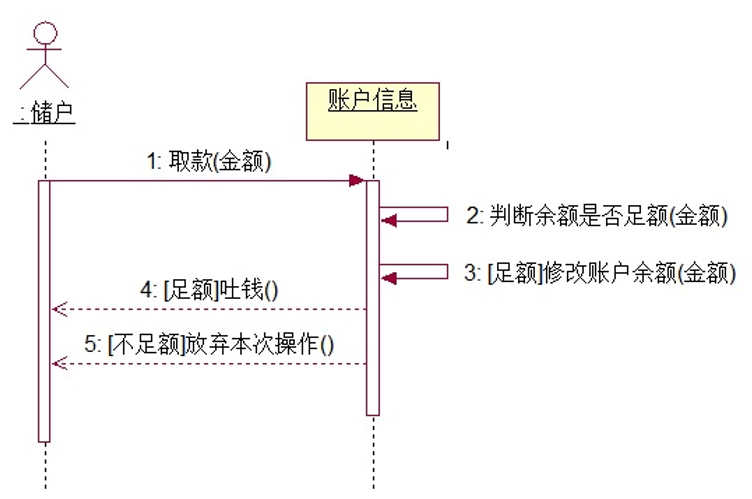
 {}
 {} 
 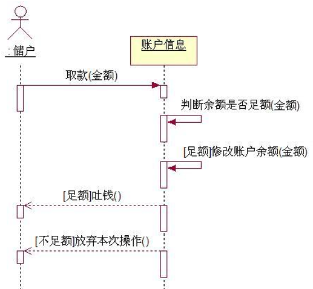
 {}
 {} 
 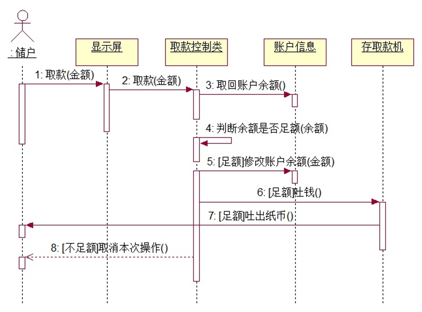
 {}
 {}