#### 用例图

#### 1、参与者
指系统以外的、需要**使用**系统或与系统**交互**的外部实体（**亲自操作**）

{} *读者通过系统管理员在某大学图书管理系统中办理借书证。读者分学生和教师。读者借还书籍要通过图书管理员来完成。系统管理员负责图书管理系统的借书证维护和图书数据维护等操作*
	
	{} 
 *图书管理员、系统管理员*
 	{}

 {}

#### 2、用例
用例定义了参与者和系统之间的交互实现的一个业务目标
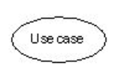

#### 3、泛化关系
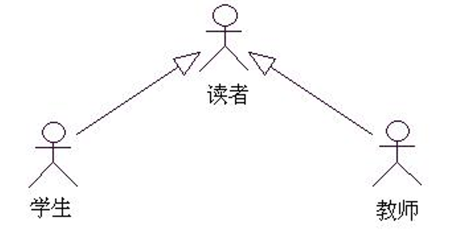

有共同点和不同点（简化共同点，保留不同点）			
作用： 有效地减少了参与者与用例之间的关联关系的个数，简化了用例模型

 
(1)、一般参与者与特殊参与者之间的关系
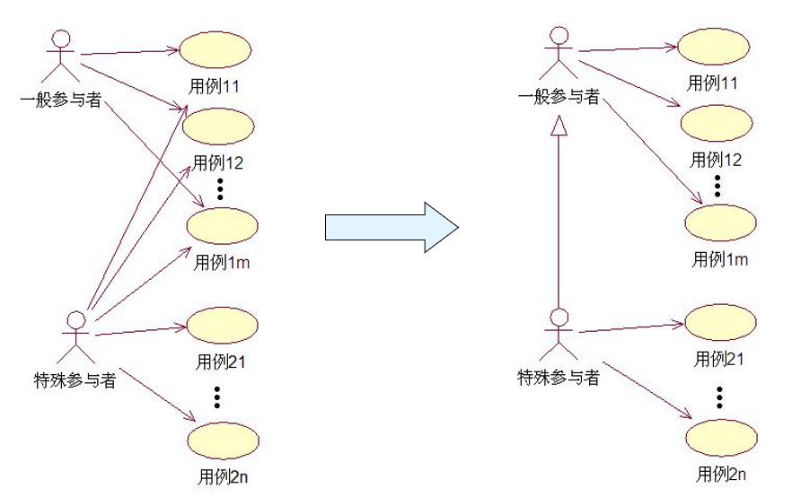
(2)、特殊用例继承、覆盖、增加一般用例的行为
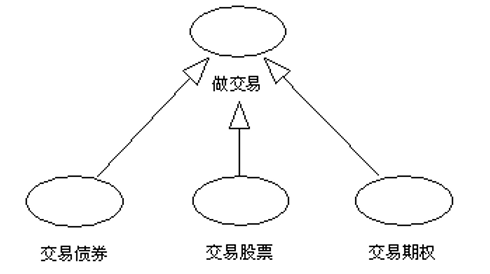

#### 4、关联/交互关系(参与者与用例之间的关系)
参与者完成系统的一项功能
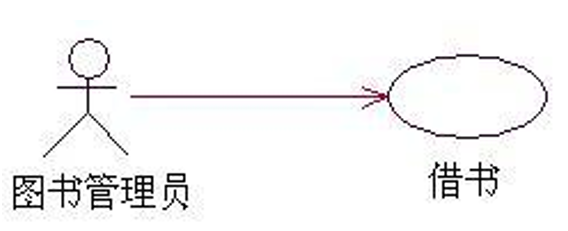

#### 5、包含关系(基本用例的行为**必然执行**包含用例的行为)
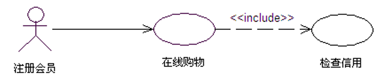

#### 6、扩展关系(基本用例的行为**条件执行**扩展用例的行为)
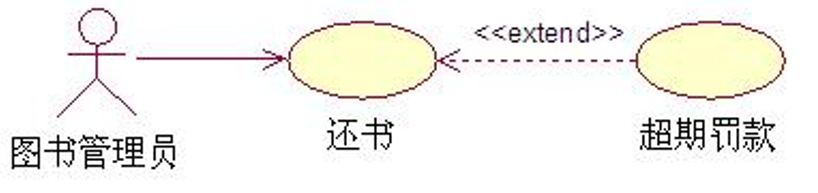

{} *有一个学生“选课系统”。通过这个系统，学生在登录系统后可以查询课程、注册课程。每学期的“课程目录”信息从旧的课程目录系统读取而不能更改。*
 
*每学期开始时，系统管理员会开放注册。学生在选择课程前，需要先通过查询获取本学期的“课程目录”。学生在完成选课时可以生成课程表，也可以在完成选课后随时生成课程表。系统管理员在开学2周后关闭注册。*
 
*系统管理员在登录后可以维护学生信息，开放注册和关闭注册。*
	{} 
 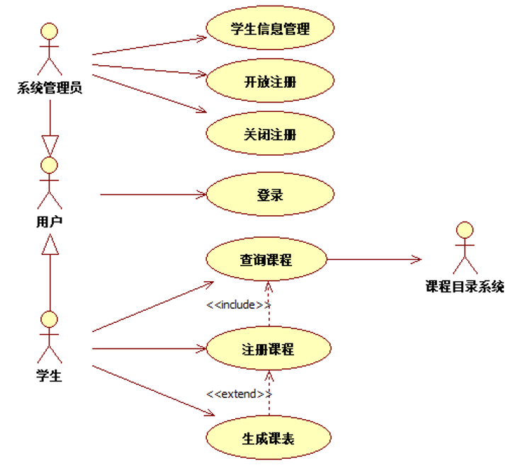
 	{}
 {}
 

#### 7、系统边界(指系统与系统之间的界限)
**系统边界**用实线方框图形符号表示			
**用例**绘制在方框里面（即边界里面）			
**参与者**绘制在方框外面（即边界外面）

{} *在一个仅为交易客户提供买卖基金的基金交易系统中，它的参与者就是进行基金买卖的交易客户。*
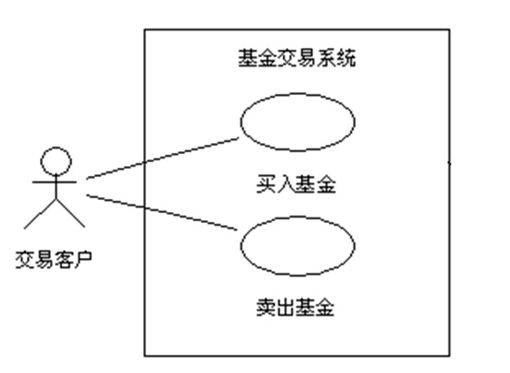
 {}
{} *但是，基金的品种应该存在于该系统中，否则交易客户无法进行基金的买卖
另一方面，基金品种的输入不应该由交易客户来完成*
 
*因此，基金品种的输入应该由另外一个系统（不妨假设它叫基金管理系统）完成*
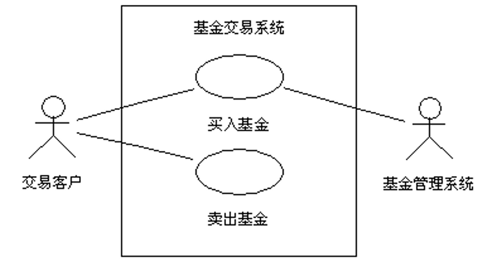
 {}
 {} *现在开发了一个新的基金交易系统
该系统必须提供基金的买卖和基金品种的管理，由基金公司员工来管理基金品种*
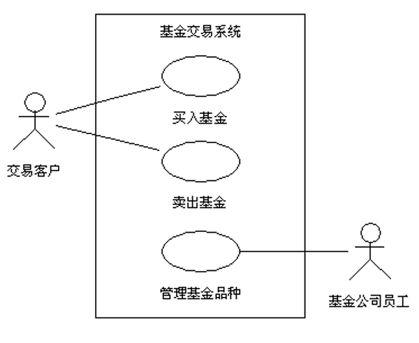
 {}